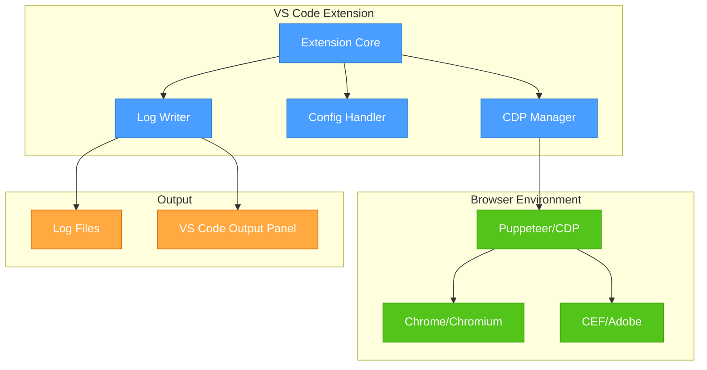
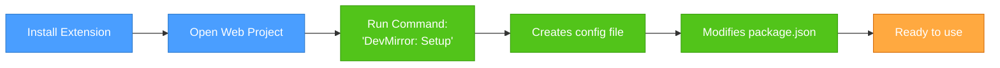

# DevMirror - Lean Development & Workflow Plan

## Overview
A VS Code extension that captures 100% of browser console output using Chrome DevTools Protocol (CDP), creating timestamped log files for web development, including support for Adobe CEP extensions.

## Core Architecture



## Development Plan

### Project Structure
```
devmirror/
├── src/
│   ├── extension.ts         # Entry point & activation
│   ├── cdpManager.ts        # CDP connection & event handling
│   ├── logWriter.ts         # File writing & formatting
│   ├── configHandler.ts     # Config file management
│   ├── scriptModifier.ts    # package.json modification
│   └── cefBridge.ts         # Adobe CEF support
├── package.json
├── tsconfig.json
└── README.md
```

### Core Implementation

#### 1. Extension Entry Point
```typescript
// src/extension.ts
import * as vscode from 'vscode';
import { CDPManager } from './cdpManager';
import { ConfigHandler } from './configHandler';
import { ScriptModifier } from './scriptModifier';

export function activate(context: vscode.ExtensionContext) {
    // Single command: setup project
    const setupCommand = vscode.commands.registerCommand('devmirror.setup', async () => {
        const config = new ConfigHandler(vscode.workspace.rootPath);
        const modifier = new ScriptModifier();
        
        // Create config file
        await config.initialize();
        
        // Modify package.json
        await modifier.addMirrorScripts();
        
        vscode.window.showInformationMessage('DevMirror setup complete! Run "npm run dev:mirror" to start.');
    });
    
    context.subscriptions.push(setupCommand);
}
```

#### 2. CDP Manager (Core Functionality)
```typescript
// src/cdpManager.ts
import * as puppeteer from 'puppeteer-core';
import { LogWriter } from './logWriter';

export class CDPManager {
    private browser: puppeteer.Browser;
    private page: puppeteer.Page;
    private logWriter: LogWriter;
    private messageCount = new Map<string, number>();
    private lastReset = Date.now();
    
    async start(config: DevMirrorConfig) {
        this.logWriter = new LogWriter(config.outputDir);
        
        // Launch browser with CDP
        this.browser = await puppeteer.launch({
            headless: false,
            devtools: true,
            executablePath: config.chromePath || puppeteer.executablePath(),
            args: ['--auto-open-devtools-for-tabs']
        });
        
        this.page = await this.browser.newPage();
        
        // Setup all CDP listeners
        await this.setupListeners();
        
        // Navigate to dev server
        await this.page.goto(config.url);
    }
    
    private async setupListeners() {
        const client = await this.page.target().createCDPSession();
        
        // Enable necessary domains
        await client.send('Runtime.enable');
        await client.send('Network.enable');
        await client.send('Log.enable');
        await client.send('Security.enable');
        
        // Console API calls
        client.on('Runtime.consoleAPICalled', (event) => {
            this.handleConsoleMessage(event);
        });
        
        // JavaScript exceptions
        client.on('Runtime.exceptionThrown', (event) => {
            this.logWriter.write({
                type: 'error',
                message: event.exceptionDetails.text,
                stack: event.exceptionDetails.stackTrace,
                timestamp: Date.now()
            });
        });
        
        // Network failures
        client.on('Network.loadingFailed', (event) => {
            this.logWriter.write({
                type: 'network',
                message: `Failed to load: ${event.errorText}`,
                url: event.request?.url,
                timestamp: Date.now()
            });
        });
        
        // Browser logs (CSP violations, etc.)
        client.on('Log.entryAdded', (event) => {
            this.logWriter.write({
                type: 'browser',
                level: event.entry.level,
                message: event.entry.text,
                source: event.entry.source,
                timestamp: event.entry.timestamp
            });
        });
        
        // Page lifecycle
        this.page.on('load', () => {
            this.logWriter.write({
                type: 'lifecycle',
                message: '════════════ Page Loaded ════════════',
                url: this.page.url(),
                timestamp: Date.now()
            });
        });
    }
    
    private handleConsoleMessage(event: any) {
        const message = this.formatConsoleArgs(event.args);
        const hash = this.hashMessage(message);
        
        // Simple deduplication
        if (Date.now() - this.lastReset > 1000) {
            this.messageCount.clear();
            this.lastReset = Date.now();
        }
        
        const count = (this.messageCount.get(hash) || 0) + 1;
        this.messageCount.set(hash, count);
        
        if (count <= 100) {
            this.logWriter.write({
                type: 'console',
                method: event.type,
                message: message,
                stack: event.stackTrace,
                timestamp: event.timestamp,
                count: count > 1 ? count : undefined
            });
        } else if (count === 101) {
            this.logWriter.write({
                type: 'suppressed',
                message: `[SUPPRESSED] Message repeated 100+ times: ${message.substring(0, 100)}...`,
                timestamp: Date.now()
            });
        }
    }
}
```

#### 3. Configuration
```typescript
// Config structure - single source of truth
interface DevMirrorConfig {
    url: string;              // Dev server URL
    outputDir: string;        // Log output directory
    chromePath?: string;      // Optional Chrome executable
    mode: 'cdp' | 'cef';     // CDP or Adobe CEF
    cefPort?: number;         // For Adobe CEF debugging
}
```

### Package.json Modification

The extension automatically creates mirror scripts:

```javascript
// src/scriptModifier.ts
export class ScriptModifier {
    async addMirrorScripts() {
        const packageJson = JSON.parse(await fs.readFile('package.json', 'utf8'));
        
        // Find dev-like scripts
        const scriptsToMirror = Object.keys(packageJson.scripts)
            .filter(name => name.includes('dev') || name.includes('start'));
        
        // Create mirror versions
        scriptsToMirror.forEach(name => {
            const mirrorName = `${name}:mirror`;
            const originalScript = packageJson.scripts[name];
            
            // Wrap with devmirror launcher
            packageJson.scripts[mirrorName] = 
                `concurrently "npx devmirror-cdp" "${originalScript}"`;
        });
        
        await fs.writeFile('package.json', JSON.stringify(packageJson, null, 2));
    }
}
```

### CLI Tool (Installed with Extension)

```typescript
#!/usr/bin/env node
// devmirror-cdp CLI tool
import { CDPManager } from './cdpManager';
import { ConfigHandler } from './configHandler';

async function main() {
    const config = await ConfigHandler.load('./devmirror.config.json');
    const cdp = new CDPManager();
    
    // Start CDP capture
    await cdp.start(config);
    
    // Keep process alive
    process.on('SIGINT', async () => {
        await cdp.stop();
        process.exit(0);
    });
}

main();
```

## User Workflow

### Initial Setup (One-Time)



**What happens:**

1. **Extension creates `devmirror.config.json`:**
```json
{
    "url": "http://localhost:3000",
    "outputDir": "./devmirror-logs",
    "mode": "cdp"
}
```

2. **Modifies `package.json`:**
```diff
{
  "scripts": {
    "dev": "vite",
+   "dev:mirror": "concurrently \"npx devmirror-cdp\" \"vite\"",
    "start": "webpack serve",
+   "start:mirror": "concurrently \"npx devmirror-cdp\" \"webpack serve\""
  }
}
```

### Daily Usage

```bash
# Instead of:
npm run dev

# Developer runs:
npm run dev:mirror
```

**What developer sees:**

```
Terminal:
━━━━━━━━━━━━━━━━━━━━━━━━━━━━━━━━━━━━━━━━━
🔴 DevMirror Active
├─ Chrome launched (CDP connected)
├─ Logging to: ./devmirror-logs/2025-01-20-143022.log
└─ Dev server: http://localhost:3000
━━━━━━━━━━━━━━━━━━━━━━━━━━━━━━━━━━━━━━━━━

[Vite] Dev server running at http://localhost:3000
```

**Browser opens with:**
- DevTools automatically open
- App loads normally
- All console output captured

### Log Output Format

```
[2025-01-20 14:30:22.123] [CONSOLE:LOG] Application started
[2025-01-20 14:30:22.456] [NETWORK:ERROR] GET http://api.example.com/users - Failed: ERR_CONNECTION_REFUSED
[2025-01-20 14:30:22.789] [CONSOLE:ERROR] TypeError: Cannot read property 'name' of undefined
    at UserList.render (UserList.js:45:23)
    at performWork (react-dom.js:2345:12)
[2025-01-20 14:30:23.123] [BROWSER:SECURITY] Refused to load script: Content Security Policy violation
[2025-01-20 14:30:25.000] ════════════ Page Reloaded ════════════
[2025-01-20 14:30:25.456] [CONSOLE:LOG] Application started
[2025-01-20 14:30:26.789] [SUPPRESSED] Message repeated 100+ times: "Polling update..."
```

### VS Code Integration

The extension adds:
1. **Output Channel** - View logs in VS Code
2. **Status Bar** - Show capture status
3. **Single Command** - Setup project

```typescript
// Status bar shows:
"🔴 DevMirror | 234 logs | 2.3 MB"

// Output panel shows real-time logs
VS Code Output Panel (DevMirror):
━━━━━━━━━━━━━━━━━━━━━━━━━━━━━━━
[14:30:22] [LOG] App initialized
[14:30:23] [ERROR] API call failed
[14:30:24] [NETWORK] 404: /api/data
━━━━━━━━━━━━━━━━━━━━━━━━━━━━━━━
```

## Adobe CEP Support

For Adobe After Effects extensions:

```json
// devmirror.config.json for CEP
{
    "mode": "cef",
    "cefPort": 8088,
    "outputDir": "./devmirror-logs"
}
```

The CDP manager connects to CEF debugger instead of launching Chrome.

## Key Features Summary

| Feature | Implementation |
|---------|---------------|
| **100% Capture** | CDP captures all console, network, security, and browser events |
| **Deduplication** | Simple throttling: 100 messages/second max per unique message |
| **Page Reloads** | Automatic markers in log on navigation events |
| **Zero Config** | Auto-detects port from dev server output |
| **File Management** | Timestamped files, automatic rotation at 50MB |
| **Performance** | Minimal overhead, async log writing |

## What This Doesn't Include (Avoided Bloat)

❌ Complex UI/Webviews - Uses VS Code's native output panel  
❌ Multiple bridge types - CDP only (except CEF for Adobe)  
❌ WebSocket fallback - CDP is required for 100% capture  
❌ Complex configuration - Single simple JSON file  
❌ Manual browser attachment - Always launches managed instance  
❌ Multiple start methods - One way: npm scripts  
❌ Log viewers/analyzers - Raw timestamped text files  
❌ HAR export, heap snapshots - Scope creep  

## Implementation Checklist

### Core Features
- [ ] Extension activation and command registration
- [ ] CDP connection via Puppeteer
- [ ] Event listeners for all CDP domains
- [ ] Log file writer with timestamps
- [ ] Message deduplication (throttling)
- [ ] Page reload detection and markers
- [ ] Package.json script modification
- [ ] Config file creation and loading
- [ ] VS Code output channel integration
- [ ] Status bar item

### CDP Event Subscriptions
- [ ] `Runtime.consoleAPICalled` - Console methods
- [ ] `Runtime.exceptionThrown` - Uncaught errors
- [ ] `Network.loadingFailed` - Network errors
- [ ] `Network.responseReceived` - Network responses
- [ ] `Log.entryAdded` - Browser logs
- [ ] `Security.securityStateChanged` - Security issues
- [ ] `Page.loadEventFired` - Page loads
- [ ] `Page.frameNavigated` - Navigation events

### Adobe CEP Support
- [ ] CEF debugger connection
- [ ] Port detection from .debug file
- [ ] Node context bridging

## Testing Strategy

```typescript
// Test the core flow
describe('DevMirror E2E', () => {
    it('captures all console output', async () => {
        // Start dev:mirror
        await exec('npm run dev:mirror');
        
        // Wait for browser
        await waitFor(() => fs.existsSync('./devmirror-logs/current.log'));
        
        // Trigger console methods in browser
        await page.evaluate(() => {
            console.log('test log');
            console.error('test error');
            throw new Error('uncaught error');
        });
        
        // Verify log file
        const log = fs.readFileSync('./devmirror-logs/current.log', 'utf8');
        expect(log).toContain('test log');
        expect(log).toContain('test error');
        expect(log).toContain('uncaught error');
    });
});
```

## Success Criteria

✅ **One command setup** - Developer runs single VS Code command  
✅ **Zero configuration** - Works with defaults for 90% of projects  
✅ **100% capture** - No console message missed via CDP  
✅ **Transparent operation** - Dev workflow unchanged except script name  
✅ **Reliable deduplication** - Infinite loops don't crash/flood  
✅ **Clear log format** - Human-readable, timestamped, greppable  
✅ **Minimal dependencies** - Just Puppeteer for CDP  

## Configuration Reference

### Minimal (Auto-detected)
```json
{
    "url": "http://localhost:3000"
}
```

### Full Options
```json
{
    "url": "http://localhost:3000",
    "outputDir": "./devmirror-logs", 
    "mode": "cdp",
    "chromePath": "/usr/bin/google-chrome",
    "throttle": {
        "maxPerSecond": 100,
        "suppressAfter": 100
    }
}
```

### Adobe CEP
```json
{
    "mode": "cef",
    "cefPort": 8088,
    "outputDir": "./devmirror-logs"
}
```